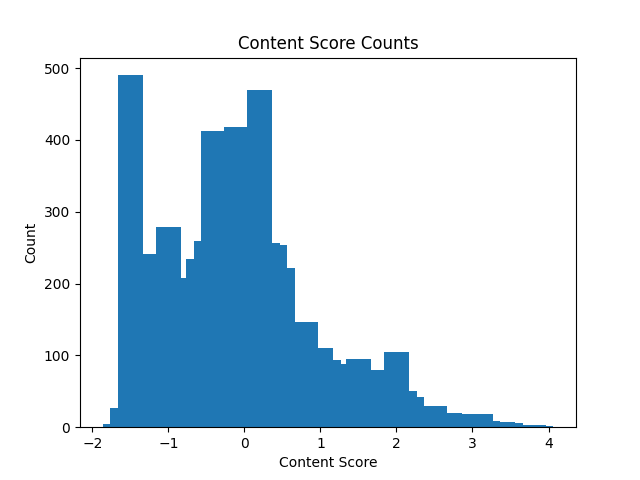
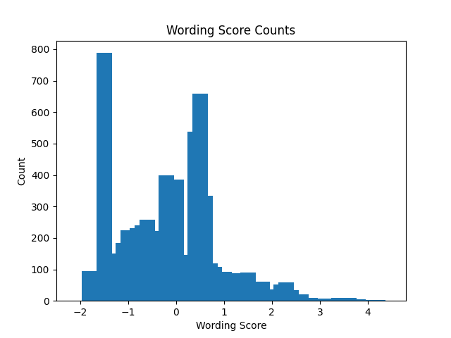
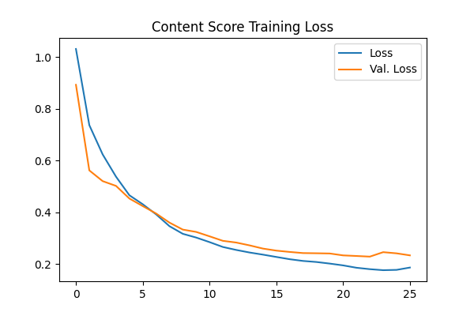
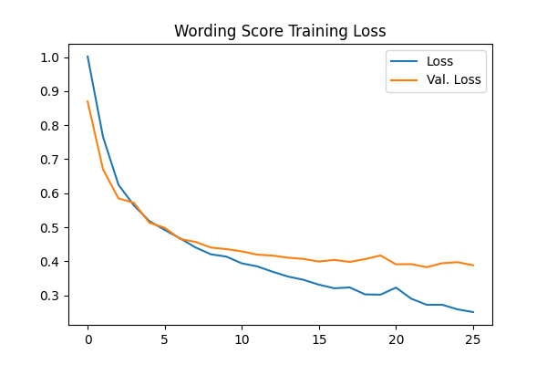

# Predicting Student Book Report Scores Using Document Embeddings and Neural Networks

(Kaggle Competition Link: https://www.kaggle.com/competitions/commonlit-evaluate-student-summaries)

<br />

## Background

In the summer of 2023, Vanderbilt University launched a competition on kaggle searching for a strong model to enable automatic grading for teachers. 

Sponsored by CommonLit (a literacy program and ELA that provides benchmark assessments and standard-based data for teachers), the data provided by the competition were short student written essays for four one of four different prompts, all placed in a csv file (with each row containing the report for a prompt written by a student, along with the corresponding scores). There were two scores which needed to be predicted straight from the students' essays, one for content, and one for wording. To do this accurately and efficiently, the documents need to be embedded, and the resulting vectors will be used as input for two predictive models; one to predict the content score, and one to predict the wording score. Multiple different embedding and regression models were tested, and through trial and error, the best models we created used embeddings from the FlagEmbedding model (https://github.com/FlagOpen/FlagEmbedding) and a Neural Network for score prediction models. The sections below will be a walkthrough of the entire process.

(Note that Doc2Vec and a spin on TFIDF were also tried as embedding methods, and XGBoost was tried as a predictive model. See `Doc2Vec/doc2vec_controller.py`, `TFIDF/tfidf_controller.py`, and `Models/XGBoost/vector_xgboost_trainer.py` for more details),
(Also note that due to competition rules, the actual data used is not included here, but can be found at the Kaggle competition page linked above).

<br />

## Exploratory Data Analysis

To get a quick idea of what the data looks like, the distribution of each score type will be explored. The function below will round each score to the nearest tenth, then plot both the content wording score types.

```python
import pandas as pd
from matplotlib import pyplot as plt


def visualize_data_distributions():
    """Function to visualize content and wording score distributions"""

    # Load data
    data = pd.read_csv(f"/Data/ProvidedData/summaries_train.csv", encoding='utf-8')

    # Round scores
    data["content"] = round(data["content"], 1)
    data["wording"] = round(data["wording"], 1)

    # Sort scores
    content_dict = dict()
    wording_dict = dict()
    for i in sorted(data["content"].unique(), reverse=False):
        content_dict[i] = len(data[data["content"] == i])
    for i in sorted(data["wording"].unique(), reverse=False):
        wording_dict[i] = len(data[data["wording"] == i])

    # Plot scores
    plt.bar(content_dict.keys(), content_dict.values(), width=0.33)
    plt.xlabel("Content Score")
    plt.ylabel("Count")
    plt.title("Content Score Counts")
    plt.savefig("EDA/ContentScoreCounts.png")
    plt.show()
    plt.bar(wording_dict.keys(), wording_dict.values(), width=0.33)
    plt.xlabel("Wording Score")
    plt.ylabel("Count")
    plt.title("Wording Score Counts")
    plt.savefig("EDA/WordingScoreCounts.png")
```

    

From the plots above, it can be seen that the range of scores is roughly between -2 and 4. Both score types seem to be skewed to the right, with the content scores having a stronger skew. If -2 is the lower end of the grading scale, then it could be very much possible that the students are struggling, or that the teachers are grading very harshly. In either case, automating grading would give the teachers more time to focus on teaching, which would help the students turn in higher quality work, and raaise scores in either scenario.

<br />

## Data Split
Before we begin creating our models, we must split our data into a training, validation, and test set. Since there are four different prompts in the data set, some bias could be introduced if a random split was used. We need a way to get an even representation of each prompt across all three sets, and the best way to do this is by using a rotation. We will make another class to do this.

```python
class DataSplitController:
    """Class to spilt data into train, test and validation sets"""

    def __init__(self):
        print("Loading in dataset")
        ## Data could not be shared publicly, but if following these same steps, input the path to the data below
        self.df = pd.read_csv("/PATH_TO_DATASET")
        self.training_rows = []
        self.validation_rows = []
        self.test_rows = []
```

For each prompt, each data point (student report) was iterated over, with every fourth report going to the validation set, every eighth report going to the test set, and the rest to the training set. The result was a training set that comprised of about 75% of the data, and testing and validation sets that comprised of about 12.5% of the data each. We will add two more methods to our class to do this.

```python
def sort_data_with_rotation(self):
    """Function to split data using a rotation"""
    for prompt in self.df["Prompt"].unique():
        prompt_df = self.df[self.df["Prompt"] == prompt]
        prompt_df.reset_index(inplace=True, drop=False)
        counter = 1
        for i in range(len(prompt_df)):
            print(f"Sorting data for prompt: {prompt};  Progress: {counter}/{len(prompt_df)}")
            # Extract data and assign to a set
            prompt_id = prompt_df["prompt_id"][i]
            filename = f"{prompt_id}_{prompt_df['student_id'][i]}.txt"
            text = prompt_df["text"][i]
            content_score = prompt_df["content"][i]
            wording_score = prompt_df["wording"][i]
            row = (filename, prompt_id, text, content_score, wording_score)
            if counter % 8 == 0:
                self.test_rows.append(row)
            elif counter % 4 == 0:
                self.validation_rows.append(row)
            else:
                self.training_rows.append(row)
            counter += 1

def save_data_to_csv(self, rows, set_type):
    """
    Function to take training, test, or validation set rows from the main dataset and create a csv file from them
    :param rows: Training, test, or validation set row indexes
    :param set_type: String which could be any of: 'Training', 'Test', 'Validation'
    :return: None
    """
    print(f"Saving {set_type} Set to csv")
    columns = ["Filename", "Prompt", "Text", "Content Score", "Wording Score"]
    set_df = pd.DataFrame(rows, columns=columns)
    set_df.to_csv(f"{set_type}Set.csv", index=False)
```

Creating an instance of our data split controller class and calling these two methods will split and save the data. Once that is finished, we are ready to begin model building.

<br />


## Embedding Documents

With data split, we can now begin to transform our data into vectors by embedding each student report. We will use the HuggingFace library to embed documents, which allows for an easy api call to many different language and embedding models. We will make a class to do this.

```python
import pickle
import urllib3
import pandas as pd
from langchain.embeddings import HuggingFaceEmbeddings
import os

load_dotenv()

# Ignore warnings
urllib3.disable_warnings()


class HuggingFaceVectorController:

    def __init__(self):
        """Class of helpers to get document vectors from Hugging Face"""

        self.logs = Logger()
        self.embeddings = HuggingFaceEmbeddings(model_name="BAAI/bge-large-en-v1.5",
                                                cache_folder=f"/BigModels",
                                                encode_kwargs={'normalize_embeddings': False})
        self.successful_files = 0
        self.failed_files = 0
        self.failed_filenames = []
        self.filename_to_vector = dict()
        self.prompt_to_vector = dict()
        self.prompts = dict()
```
The model we found best to use for embeddings is the FlagEmbedding LLM (https://github.com/FlagOpen/FlagEmbedding), which is set in the `model_name` parameter above and is a file path that hugging face will use to find the model (for a list of models supported and paths to those models, follow this link: https://huggingface.co/spaces/mteb/leaderboard).
We'll next write a method to retrieve a vector for a document. This is very simple, as all we have to do is input the text from a student report to the `embed_query` function from HuggingFace, and we will be returned a 1024 dimensional vector.

```python
def get_document_vector(self, text, filename, total_files=1, counter=0):
    """
    Function to get a vector for a document
    :param text: Text from the file being processed
    :param filename: The name of the file being processed
    :param total_files: The total number of files being processed
    :param counter: The total number of files that have been processed so far
    :return: The document vector
    """
    # Get document vector
    document_vector = self.embeddings.embed_query(text)

    # Return vector
    print(f"Successfully retrieved vector for {filename}\tSTATS:  - Successful Documents: {self.successful_files}  - Failed Documents: {self.failed_files}  - Total Processed: {counter}/{total_files}")
    self.successful_files += 1
    return document_vector
```

To put all the pieces together, we will write two final methods, one to iterate through all documents and retrieve their vectors, and one to save all vectors to a file. Then we can move on to model training.

```python
def get_all_document_vectors(self):
    """Function to find vectors for all documents"""
    DATA_PATH = f"$PATH TO PROJECT ROOT$/Data/ExtractedData/ModelTraining/FullData"
    # Iterate through prompts
    prompts = os.listdir(DATA_PATH)
    prompt_lengths = sum([len(os.listdir(f"{DATA_PATH}/{prompt}")) for prompt in prompts])
    counter = 1
    for prompt in prompts:
        print(f"Getting vectors for prompt: {prompt}")

        # Get document vectors
        self.filename_to_vector[prompt] = dict()
        # Iterate through files
        for filename in os.listdir(f"{DATA_PATH}/{prompt}"):
            FILE_PATH = f"{DATA_PATH}/{prompt}/{filename}"
            try:
                with open(FILE_PATH, 'r', encoding='utf-8') as file:
                    text = file.read()
                file.close()
            except UnicodeDecodeError as e:
                self.logs.error(f"Failed opening {filename}; Details: {str(e)}")
                self.failed_files += 1
                self.failed_filenames.append(filename)
            else:
                document_vector = self.get_document_vector(text, filename, prompt_lengths, counter)
                if document_vector is not None:
                    self.filename_to_vector[prompt][filename] = document_vector
            counter += 1

    # Save all filenames that failed
    with open("vector_failed_files.txt", "w") as failed_file:
        failed_file.write(str(self.failed_filenames))
    failed_file.close()

    # Save vectors
    self.save_document_vectors()

    # Return vector
    print(f"Successfully retrieved vector for {filename}\tSTATS:  - Successful Documents: {self.successful_files}  - Failed Documents: {self.failed_files}  - Total Processed: {counter}/{total_files}")
    self.successful_files += 1
    return document_vector

def save_document_vectors(self):
    """Function to save document vectors to a pickle file"""
    print("Saving document vectors")
    DATA_PATH = f"$PATH TO PROJECT ROOT$/Data/ExtractedData/ModelTraining"
    with open(f"{DATA_PATH}/document_vectors.pkl", "wb") as pklfile:
        pickle.dump(self.filename_to_vector, pklfile)
        pklfile.close()
```

<br />

## Model Training

We are now going to use our vectors to train a model. We will utilize multi-layered perceptron models and we will use tensorflow and keras to build them. Observe the class below, which to helps to automate this process. Initializing this class will load our data in the training, test, and validation sets, and then load all of our vectors as well.

```python
import pickle
import pandas as pd
import numpy as np
import keras_tuner as kt
import matplotlib.pyplot as plt
import tensorflow as tf
from numpy.linalg import norm
from tensorflow import keras
from keras.callbacks import EarlyStopping
from Logs.log_config import Logger
from Models.model_evaluator import *
import os
import shutil

# Suppress warnings
os.environ['TF_CPP_MIN_LOG_LEVEL'] = '2'

# Set seed
keras.utils.set_random_seed(33)

class TensorflowTrainer:
    """Class to train a tensorflow model"""

    def __init__(self, dependent_variable):
        self.logs = Logger()
        self.dependent_variable = dependent_variable
        self.best_params = None
        self.train_rmse = None
        self.validation_rmse = None
        self.test_rmse = None
        
        # Load vectors
        print("Loading Document Vectors")
        with open(f"$PATH TO PROJECT ROOT$/Data/ExtractedData/ModelTraining/document_vectors.pkl", "rb") as pklfile:
            self.document_vectors = pickle.load(pklfile)
            pklfile.close()
            
        # Load student essays
        print("Loading Split Data")
        training_set = pd.read_csv(f"$PATH TO PROJECT ROOT$/Data/ExtractedData/ModelTraining/SplitData/TrainingSet.csv")
        validation_set = pd.read_csv(f"$PATH TO PROJECT ROOT$/Data/ExtractedData/ModelTraining/SplitData/ValidationSet.csv")
        test_set = pd.read_csv(f"$PATH TO PROJECT ROOT$/Data/ExtractedData/ModelTraining/SplitData/TestSet.csv")
        
        # Initialize training, validation, and test sets
        self.X_train = self.define_vector_sets(training_set)
        self.X_validation = self.define_vector_sets(validation_set)
        self.X_test = self.define_vector_sets(test_set)
        self.y_train = training_set[dependent_variable]
        self.y_validation = validation_set[dependent_variable]
        self.y_test = test_set[dependent_variable]

    def define_vector_sets(self, df):
        """Function to grab vectors for train, validation, and tests sets"""
        vectors = []
        for i in range(len(df)):
            # Load document and prompt vectors
            filename = df["Filename"][i]
            prompt = df["Prompt"][i]
            document_vector = self.document_vectors[prompt][filename]
            vectors.append(document_vector)

        return pd.DataFrame(vectors)
```

Our next order of business is to train our models. As stated earlier, we are using multi-layered perceptron models with our 1024 dimensional vectors as input. Selecting the optimal number of hidden layers needed, and the optimal number of neurons per layer was a trial and error process, yielding the optimal number of hidden layers for both score types to be 2 and the optimal number of neurons to be 1024.

```python
def train_model(self):
    """Function to train model"""
    print("Training tensorflow model")

    # Initialize model
    model = keras.Sequential([
        keras.layers.InputLayer(input_shape=(1024,)),
        keras.layers.Dense(1024, activation='relu', name='hidden1'),
        keras.layers.Dense(1024, activation='relu', name='hidden2'),
        keras.layers.Dense(1, name='output')
    ])
    early_stop = EarlyStopping(monitor="val_loss", mode="min", verbose=1, patience=3)
    
    # Train model
    model.compile(optimizer='adam', loss='mean_squared_error', metrics=['mean_squared_error'])
    model.fit(self.X_train, self.y_train, epochs=2000, batch_size=2048, verbose=1,
              validation_data=(self.X_validation, self.y_validation), callbacks=[early_stop])

    # Plot training losses
    print("Plotting training losses")
    losses = pd.DataFrame(model.history.history)
    plt.figure(figsize=(6, 4))
    plt.plot(losses["loss"], label="Loss")
    plt.plot(losses["val_loss"], label="Val. Loss")
    plt.title(f"{self.dependent_variable} Training Loss")
    plt.legend()
    plt.savefig(f"{self.dependent_variable.replace(' ', '')}/{self.dependent_variable.replace(' ', '')}TrainingLoss.png")

    # Evaluate model
    print(f"Collecting {self.dependent_variable} model performance statistics")
    self.train_rmse, self.validation_rmse, self.test_rmse = calculate_performance_metrics('Tensorflow',
                                                                                          self.dependent_variable,
                                                                                          model, self.X_train,
                                                                                          self.X_validation,
                                                                                          self.X_test, self.y_train,
                                                                                          self.y_validation,
                                                                                          self.y_test,
                                                                                          best_params=self.best_params)

    # Save model
    print(f"Saving {self.dependent_variable} model and performance statistics")
    tf.keras.models.save_model(model, f"{self.dependent_variable.replace(' ', '')}/{self.dependent_variable.replace(' ', '')}SavedModel")

```

The function above trains and evaluates a model for us (notice we use the `calculate_performance_metrics` to evaluate our model, which comes from a helper class, `ModelEvaluator`, we wrote to do this and can be viewed in `Models/model_evaluator.py`). Running the main function below will create models for both content and wording scores.

```python
if __name__ == '__main__':
    #  Initialize model trainers
    content_trainer = TensorflowTrainer("Content Score")
    wording_trainer = TensorflowTrainer("Wording Score")

    # Train BigModels
    content_trainer.train_model()
    wording_trainer.train_model()

    # Initialize model evaluator
    model_evaluator = ModelEvaluator('Tensorflow', content_trainer, wording_trainer)

    # Evaluate models
    model_evaluator.evaluate_models()
```

<br />

## Model Evaluation

With both models trained and optimized, we can now see how they performed. First we will check for overfitting, by viewing plots of our training losses.

  

The plots above show that, for both models, our validation loss is right on par with our training loss, with our validation loss for wording score deviating slightly more than the content score. This deviation is not severe, and just alerts us that our wording score model may not capture as much variance in the data as the content score model. In any case, these plots look good, and show us that our models are not overfitted to the training data.

The competition's main scoring metric was Mean Columnwise Root Mean Squared Error (MCRMSE), which is essentially the average RMSE for both models. We calculated the following accuracy metrics on our test set for each model:

```text
Content Score:
    - RMSE : 0.4945
    - R-squared: 0.7681
    
Wording Score:
    - RMSE: 0.6437
    - R-squared: 0.62502
    
 MCRMSE: 0.5691 
```

As expected, our content score model performed slightly better than our wording score model, but both models were still very accurate. On average, our the score given to a student's report by our model would, on average, roughly half a point off. This is very fair, especially for smaller assignments like this, as our models capture a very solid picture of how the report was written. 


<br />

## Conclusion

While we did not win the competition, this was still a fun and educative project to work on. Our MCRMSE was only 0.15 higher than the winning score, so our model was very competitive in a field of over 2000 teams. The bigger takeaway, however, is that we created a model that could have very positive real world effects. These models could be a very useful tool to overloaded teachers, who could use them to grade smaller assignments. Teachers could use these hours of extra time to focus more directly on teaching their students, and helping them learn and grow as much as they can.